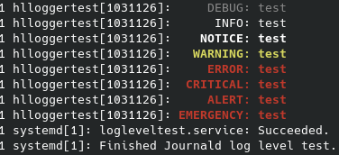

# High Level Logger

[](https://pkg.go.dev/github.com/hekmon/hllogger/v2)


HlLogger is an opinionated logger on top of the Golang standard library logger. It adds:

* syslog inspired logging facilities such as:
  * Debug
  * Info
  * Notice
  * Warning
  * Error
  * Critical
  * Alert
  * Emergency
* automatic systemd-journald integration if systemd is detected as executor and output is `os.Stdout` or `os.Stderr`

## Installation

```bash
go get github.com/hekmon/hllogger/v2
```

## Usage

```golang
package main

import (
	"os"

	"github.com/hekmon/hllogger/v2"
)

func main() {
	logger := hllogger.New(os.Stdout, hllogger.Debug)
	logger.Debug("test")
	logger.Info("test")
	logger.Notice("test")
	logger.Warning("test")
	logger.Error("test")
	logger.Critical("test")
	logger.Alert("test")
	logger.Emergency("test")
}
```

If you init the logger with the `hllogger.Info` level, all calls to `logger.Debug()` will no-op (won't print anything). If you init the logger with the `hllogger.Notice` level, all calls to to `logger.Debug()` and `logger.Info()` will no-op (won't print anything). And so on...

### Regular output

Raw ouput on your terminal (if not started by systemd or if started by systemd but output is not `os.Stdout` or `os.Stderr`).

```raw
2022/02/14 20:37:31     DEBUG: test
2022/02/14 20:37:31      INFO: test
2022/02/14 20:37:31    NOTICE: test
2022/02/14 20:37:31   WARNING: test
2022/02/14 20:37:31     ERROR: test
2022/02/14 20:37:31  CRITICAL: test
2022/02/14 20:37:31     ALERT: test
2022/02/14 20:37:31 EMERGENCY: test
```

### systemd-journald integration

If started by systemd and output is `os.Stdout` or `os.Stderr`. By integrating with systemd-journald, the lib will indicate the log level of each log to journald. It will allows log manipulation directly with journald (printing only info level while debug have been printed) but also log level highlighting (colors).

#### log level highlighting



#### emergency broadcast

```bash
hekmon@testserver1:~$ sudo systemctl start logleveltest.service

Broadcast message from systemd-journald@testserver1 (Mon 2022-02-14 20:47:52 UTC):

hlloggertest[1031126]: EMERGENCY: test

hekmon@testserver1:~$
```